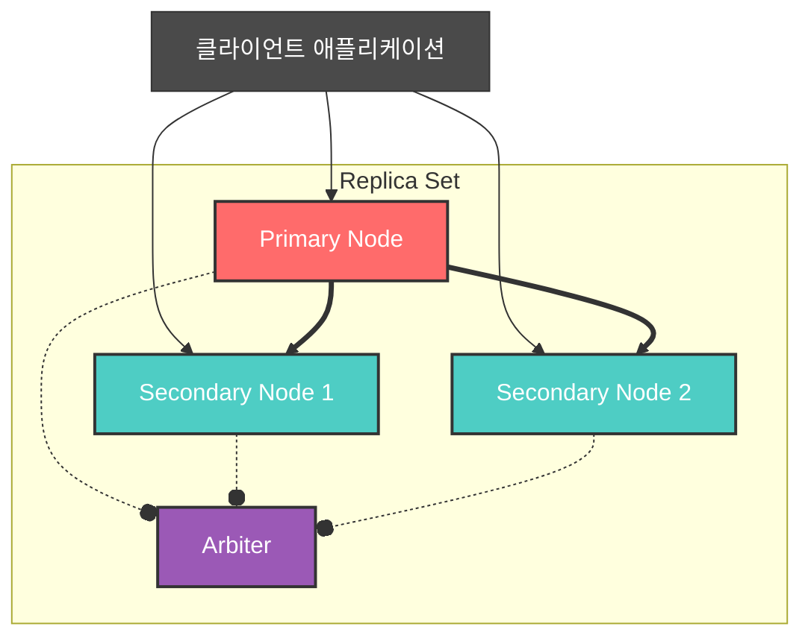
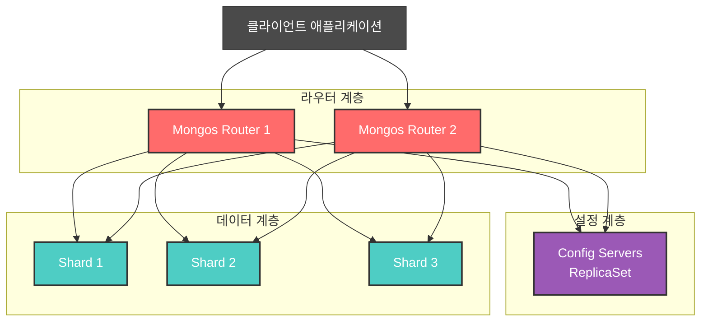
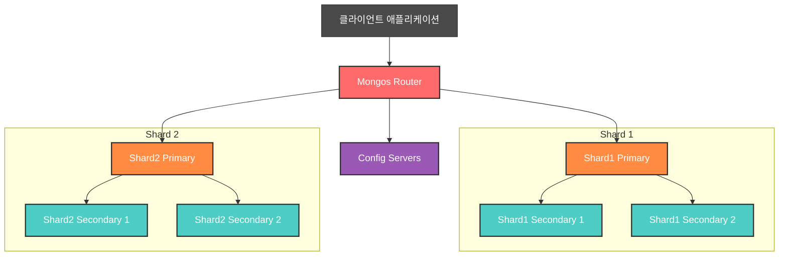

## MongoDB란?

MongoDB는 **문서 지향(Document-Oriented)** 데이터베이스 시스템으로 JSON 형태의 데이터를 저장하고 관리합니다. 문서는 "field : value" 쌍으로 구성된 데이터 구조로 JSON 객체와 유사하며, value에는 다른 documents, arrays 및 문서의 배열(arrays of documents)을 포함할 수 있습니다.


### 주요 특징

- **Replication 기능과 Sharding 기능**을 통해 복제 및 분산 처리가 가능
- **MapReduce**를 통해 빅 데이터에 대한 빠른 추출 가능
- **빅 데이터의 빠른 쓰기와 읽기 작업**이 가장 큰 장점
- **메모리 매핑 기술**을 통해 빅 데이터의 효율적 처리에 최적화된 인메모리 데이터베이스 구조 제공

## RDBMS와의 구조 비교

다음은 관계형 데이터베이스의 논리적 구조에 대한 용어와 MongoDB의 논리적 구조에서 사용하는 용어들에 대한 차이점을 비교한 표입니다.

| RDBMS        | MongoDB       |
| ------------ | ------------- |
| Database     | Database      |
| Table        | Collection    |
| Row          | Document      |
| Column       | Field         |
| Primary Key  | Object_id     |
| Relationship | Embedded & Link |

## MongoDB의 장점

### 1. 스키마 유연성
- 스키마가 유연하고 확장성이 뛰어남
- 데이터 구조 변경이 용이함

### 2. 높은 성능
- **Embedded data models** 지원으로 데이터베이스 시스템의 I/O 감소
- **인덱스**로 빠른 쿼리 지원
- Embedded documents와 배열의 키를 포함할 수 있음

## Collections

MongoDB는 documents를 **Collection**에 저장합니다.

### Collection의 종류

#### 1. Capped Collection
- 최초 제한된 크기로 생성된 공간 내에서만 데이터를 저장
- 최초 공간이 모두 사용되면 다시 기존 공간을 재사용
- **제약사항**: TTL 인덱스나 Non-capped Collection보다 성능이 떨어짐

**주요 제약사항:**
- **Sharding 미지원**: Capped Collection은 샤딩을 지원하지 않습니다
- **Serverless 인스턴스 미지원**: Serverless 인스턴스에서는 Capped Collection을 생성할 수 없습니다
- **Stable API V1 미지원**: Stable API V1에서는 Capped Collection을 지원하지 않습니다
- **트랜잭션 쓰기 제한**: 트랜잭션 내에서 Capped Collection에 쓰기 작업을 수행할 수 없습니다
- **$out 집계 파이프라인 제한**: $out 집계 파이프라인 단계에서 Capped Collection에 결과를 쓸 수 없습니다

> **💡 적용 팁**: 
> 
> **성능 고려사항**: 일반적으로 TTL(Time To Live) 인덱스가 Capped Collection보다 더 나은 성능과 유연성을 제공합니다. 
> Capped Collection은 쓰기 작업을 직렬화하므로 일반 컬렉션보다 동시 삽입, 업데이트, 삭제 성능이 떨어집니다. Capped Collection을 생성하기 전에 TTL 인덱스를 대신 사용할 수 있는지 고려해보세요.
> 
> **주요 사용 사례**: Capped Collection의 가장 일반적인 사용 사례는 로그 정보 저장입니다. 기업에서 발생하는 데이터들 중에는 로그 데이터처럼 일정한 기간 내에서만 저장, 관리할 필요가 있는 데이터들이 존재하는데, 이런 경우 Capped Collection을 적용하기에 효과적입니다. Capped Collection이 최대 크기에 도달하면 오래된 로그 항목이 새로운 항목으로 자동 덮어써집니다.

## Indexes (인덱스)

인덱스는 MongoDB에서 **효율적인 쿼리 실행**을 지원하는 핵심 기술입니다. 인덱스가 없으면 MongoDB는 쿼리 결과를 반환하기 위해 컬렉션의 모든 문서를 스캔해야 합니다. 쿼리에 적합한 인덱스가 있는 경우, MongoDB는 해당 인덱스를 사용하여 스캔해야 하는 문서 수를 제한합니다.


### 인덱스의 종류

#### 1. Single Field Indexes (단일 필드 인덱스)

단일 필드 인덱스는 컬렉션의 **단일 필드 정보**를 저장합니다. 기본적으로 모든 컬렉션에는 `_id` 필드에 대한 인덱스가 있습니다.

**생성 방법:**
```javascript
db.<collection>.createIndex( { <field>: <sort-order> } )
```

**예시:**
```javascript
// user_id 필드에 오름차순 인덱스 생성
db.users.createIndex( { "user_id": 1 } )

// age 필드에 내림차순 인덱스 생성
db.users.createIndex( { "age": -1 } )
```

#### 2. Compound Indexes (복합 인덱스)

복합 인덱스는 컬렉션 내 각 문서의 **여러 필드 값**에서 데이터를 수집하고 정렬합니다. 복합 인덱스를 사용하여 인덱스의 첫 번째 필드 또는 접두사 필드를 쿼리할 수 있습니다.

**중요한 점:**
- 복합 인덱스에서 **필드 순서는 매우 중요**
- 복합 인덱스에 의해 생성된 B-트리는 인덱스가 필드를 지정하는 순서대로 정렬된 데이터를 저장

**생성 방법:**
```javascript
db.<collection>.createIndex( {
   <field1>: <sortOrder>,
   <field2>: <sortOrder>,
   ...
   <fieldN>: <sortOrder>
} )
```

**예시:**
```javascript
// groupNumber, lastname, firstname 순서로 복합 인덱스 생성
db.members.createIndex( { 
   groupNumber: 1, 
   lastname: 1, 
   firstname: 1 
} )
```

#### 3. Multikey Indexes (다중 키 인덱스)

MongoDB는 **배열 필드**에 대해 다중 키 인덱스를 생성할 수 있습니다. 배열에 동일한 값의 인스턴스가 여러 개 포함된 경우, 인덱스는 해당 값에 대한 항목을 하나만 포함합니다.

**생성 방법:**
```javascript
db.<collection>.createIndex( { <arrayField>: <sortOrder> } )
```

**예시:**
```javascript
// tags 배열 필드에 인덱스 생성
db.products.createIndex( { "tags": 1 } )

// 배열 내 embedded document의 필드에 인덱스 생성
db.collection.createIndex( { "a.loc": 1, "a.qty": 1 } )
```

#### 4. Wildcard Indexes (와일드카드 인덱스)

와일드카드 인덱스는 **모든 필드** 또는 **특정 패턴의 필드**에 대해 인덱스를 생성할 수 있습니다.

**생성 방법:**
```javascript
// 모든 필드에 대한 와일드카드 인덱스
db.collection.createIndex( { "$**": 1 } )

// 특정 패턴의 필드에 대한 와일드카드 인덱스
db.collection.createIndex( { "userMetadata.$**": 1 } )
```

#### 5. Geospatial Indexes (지리공간 인덱스)

GeoJSON 객체 또는 좌표 쌍으로 저장된 데이터에 대해 인덱스를 생성하여 지리공간 데이터에 대한 쿼리 성능을 향상시킵니다.

**지원하는 인덱스 유형:**

- **2dsphere 인덱스**: 구면의 기하 구조를 해석하는 쿼리를 지원
  - 지정된 폴리곤의 둘레 내의 위치 데이터를 쿼리 가능
  - 구면의 특정 지점 근처에 나타나는 위치 데이터를 쿼리 가능

- **2d 인덱스**: 평면의 기하 구조를 해석하는 쿼리를 지원

**생성 방법:**
```javascript
// 2dsphere 인덱스 생성
db.places.createIndex( { <location field> : "2dsphere" } )

// 2d 인덱스 생성
db.places.createIndex( { <location field> : "2d" } )
```

### Index Properties (인덱스 속성)

인덱스 속성은 query planner가 인덱스를 사용하는 방식과 인덱싱된 문서가 저장되는 방식에 영향을 미칩니다. 인덱스를 생성할 때 인덱스 속성을 선택적 매개변수로 지정할 수 있지만, 모든 인덱스 유형이 모든 인덱스 속성과 호환되는 것은 아닙니다.

#### 1. Case-Insensitive Indexes (대소문자 구분 없는 인덱스)

대소문자 구분 없는 인덱스는 **대소문자를 구분하지 않고** 문자열을 비교하고, 해당 index는 **collation**의 locale과 strength를 상속받습니다.

**중요**: `$regex` 연산자는 collation을 인식하지 못하므로 대소문자 구분 없는 인덱스는 `$regex` 쿼리의 성능을 향상시키지 않습니다.

**생성 방법:**
```javascript
db.collection.createIndex(
   {
      <field>: <sortOrder>
   },
   {
      collation:
         {
            locale : <locale>,
            strength : < 1 | 2 >
         }
   }
)
```

**Collation 설정 필드:**

| 필드 | 설명 |
|------|------|
| **locale** | 언어 규칙을 지정합니다. 사용 가능한 locale 목록은 [Supported Languages and Locales](https://www.mongodb.com/docs/manual/reference/collation-locales-defaults/#std-label-collation-languages-locales)를 참조하세요. |
| **strength** | 비교 규칙을 결정합니다. strength 값이 1 또는 2인 경우 대소문자 구분 없는 collation을 나타냅니다. |

**예시:**
```javascript


// 기본 collation이 없는 컬렉션에 대소문자 구분 없는 인덱스 생성
db.createCollection("fruit")
db.fruit.createIndex(
   { type: 1 },
   { collation: { locale: 'en', strength: 2 } }
)

// 기본 collation이 있는 컬렉션 생성
db.createCollection("names", { collation: { locale: 'en_US', strength: 2 } })
db.names.createIndex( { first_name: 1 } ) // 기본 collation 상속
```

**사용 시 주의사항:**
- Collation을 지정한 인덱스를 사용하려면 쿼리와 정렬 작업에서도 동일한 collation을 지정해야 합니다.
- 컬렉션에 기본 collation이 정의된 경우, 명시적으로 다른 collation을 지정하지 않는 한 모든 쿼리와 인덱스가 해당 collation을 상속합니다.

#### 2. Hidden Indexes (숨겨진 인덱스)

숨겨진 인덱스는 **query planner에 보이지 않게 숨김**으로써 실제로 인덱스를 삭제하지 않고도 인덱스 삭제의 잠재적 영향을 평가할 수 있습니다. 

**장점**: 영향이 부정적이라면 삭제된 인덱스를 다시 생성하는 대신 인덱스를 다시 보이게 할 수 있습니다.

**생성 방법:**
```javascript
db.collection.createIndex( { <field>: <sortOrder> }, { hidden: true } )
```

**예시:**
```javascript
// 숨겨진 인덱스 생성
db.users.createIndex( { "email": 1 }, { hidden: true } )

// 인덱스를 다시 보이게 설정
db.users.unhideIndex( "email_1" )
```

#### 3. Partial Indexes (부분 인덱스)

부분 인덱스는 **특정 조건을 만족하는 문서만** 인덱싱합니다. 필터 표현식을 사용하여 인덱싱할 문서를 제한할 수 있습니다.

**장점:**
- **저장 공간 절약**: 컬렉션의 문서 하위 집합만 인덱싱하므로 더 적은 저장 공간이 필요합니다
- **성능 비용 감소**: 인덱스 생성 및 유지 관리에 대한 성능 비용이 줄어듭니다

**사용 시나리오:**
부분 인덱스는 특정 컬럼에서 조건을 만족하는 데이터만 검색하는 것이 아니라, **해당 조건에서 다시 특정 값만 가진 데이터들을 추가로 조건 검색하는 경우**에 특히 적합합니다.

**생성 방법:**
```javascript
db.collection.createIndex(
   { <field>: <sortOrder> },
   { partialFilterExpression: { <filter> } }
)
```

**예시:**
```javascript

db.users.createIndex(
   { "deptno": 1, "ename": 1 },
   { partialFilterExpression: { sal: { $gte: 500 } } }
)

db.restaurants.createIndex(
   { cuisine: 1, name: 1 },
   { partialFilterExpression: { rating: { $gt: 5 } } }
)
```

#### 4. Sparse Indexes (희소 인덱스)

희소 인덱스는 **인덱스된 필드가 존재하는 문서만** 인덱싱합니다. 필드가 존재하지 않거나 null인 문서는 인덱스에서 제외됩니다. 인덱스가 "희소(sparse)"한 이유는 컬렉션의 모든 문서를 포함하지 않기 때문입니다.

**사용 시나리오:**
검색 대상 필드의 값이 전체 컬렉션에서 차지하는 밀도가 낮은 경우에 생성하면 유리합니다.

**생성 방법:**
```javascript
db.collection.createIndex( { <field>: <sortOrder> }, { sparse: true } )
```

**예시:**
```javascript
// score 필드가 존재하는 문서만 인덱싱 (게임 점수 시스템)
db.scores.createIndex( { "score": 1 }, { sparse: true } )

// 점수 필드가 ($lt) 90 미만인 문서만 조회
db.scores.find( { score: { $lt: 90 } } )

// hint()를 사용하여 인덱스를 명시적으로 지정
db.scores.find().sort( { score: -1 } ).hint( { score: 1 } )

// 선택적 필드에 대한 희소 인덱스
db.products.createIndex( { "discount_code": 1 }, { sparse: true } )
```

**중요한 동작 방식:**
- **불완전한 결과 방지**: 희소 인덱스가 쿼리나 정렬 작업에 불완전한 결과를 제공할 경우, MongoDB는 명시적으로 `hint()`를 사용하지 않는 한 해당 인덱스를 사용하지 않습니다.
- **고유 제약 조건과 함께 사용**: 희소 인덱스와 고유 제약 조건을 함께 사용하면 필드에 중복 값을 가진 문서는 허용하지 않지만, 해당 키를 생략한 여러 문서는 허용합니다.

**Sparse Index를 default로 사용하는 유형:**
- **2d 인덱스** (지리공간)
- **2dsphere 인덱스** (지리공간)
- **Text 인덱스** (텍스트 검색)
- **Wildcard 인덱스** (와일드카드)

#### 5. TTL Indexes (Time-To-Live 인덱스)

TTL 인덱스는 **특정 시간 후에 문서를 자동으로 삭제**하는 기능을 제공합니다. 로그, 세션 정보와 같이 한정된 시간 동안만 데이터베이스에 유지되어야 하는 특정 유형의 정보에 유용합니다.

**생성 방법:**
```javascript
db.collection.createIndex( { <field>: 1 }, { expireAfterSeconds: <seconds> } )
```

**예시:**
```javascript
// createdAt 필드 기준으로 3600초(1시간) 후 자동 삭제
db.logs.createIndex( 
   { "createdAt": 1 }, 
   { expireAfterSeconds: 3600 } 
)
```

#### 6. Unique Indexes (고유 인덱스)

고유 인덱스는 인덱스된 필드에 **중복 값을 허용하지 않습니다**. 단일 필드 고유 인덱스는 해당 필드에 값이 최대 한 번만 나타나도록 보장하고, 고유 복합 인덱스는 인덱스 키 값의 **조합**이 최대 한 번만 나타나도록 보장합니다.

**생성 방법:**
```javascript
db.collection.createIndex( <key and index type specification>, { unique: true } )
```

**예시:**
```javascript
// 단일 필드 고유 인덱스
db.members.createIndex( { "user_id": 1 }, { unique: true } )

// 복합 고유 인덱스
db.members.createIndex( 
   { groupNumber: 1, lastname: 1, firstname: 1 }, 
   { unique: true } 
)
```

**중요한 제약사항:**
- **null 값 처리**: 문서에 인덱스된 필드가 null이거나 누락된 경우, 인덱스는 해당 문서에 대해 null 값을 저장
- **단일 필드 고유 인덱스**: null 값을 가진 문서는 하나만 허용
- **복합 고유 인덱스**: 모든 인덱스 필드가 null인 문서는 하나만 허용

### 인덱스 관리 명령어

```javascript
// 인덱스 생성
db.collection.createIndex( { field: 1 } )

// 인덱스 목록 조회
db.collection.getIndexes()

// 특정 컬렉션의 모든 인덱스 재구성
db.collection.reIndex()

// 인덱스 재구성 결과 확인
db.users.reIndex()

// 인덱스 삭제
db.collection.dropIndex( "index_name" )

// 모든 인덱스 삭제 (except _id)
db.collection.dropIndexes()

// 인덱스 사용 통계 확인
db.collection.aggregate([
   { $indexStats: {} }
])
```

---

## 성능과 가용성을 극대화하기 위한 두 가지 핵심 기술

### Replication: 데이터 가용성과 내구성 확보

Replication은 데이터의 가용성과 내구성을 확보하기 위해 MongoDB에서 **동일한 데이터를 여러 서버에 복제**하는 기술입니다. 데이터베이스의 장애 처리 능력을 강화하고, 읽기 성능을 높이며, 데이터 손실을 방지합니다.

#### MongoDB Replica Set의 특징

MongoDB의 복제를 담당하는 **replica set**은 다음을 제공합니다:

- **자동 장애 조치 (automatic failover)**
- **데이터 중복성 (data redundancy)**
  - replica set은 동일한 데이터 세트를 유지관리하는 MongoDB 서버 그룹으로, 중복성을 제공하고 데이터 가용성을 높입니다.



#### 구성요소

- **Primary Node**: 모든 쓰기 작업을 처리하는 주 노드
- **Secondary Nodes**: Primary의 데이터를 복제하여 가지고 있는 보조 노드들
- **Arbiter (선택적)**: 투표권만 가진 노드로, 새로운 Primary 선출 시 참여

#### 동작 방식

- Primary에서 발생하는 모든 쓰기 작업이 **oplog**에 기록
- Secondary 노드들이 oplog를 실시간으로 동기화
- Primary 장애 시 Secondary 중 하나가 새로운 Primary로 승격

#### 사용 사례

- 고가용성이 필요한 시스템
- 재해 복구(Disaster Recovery) 대비
- 읽기 작업 분산이 필요한 경우

---

### Sharding: 수평 확장성

MongoDB에서 대용량 데이터베이스를 **수평 확장**하기 위한 기술로, 데이터를 여러 서버에 분산 저장하여 처리 성능을 높이는 방법입니다. 이는 특히 데이터의 크기나 처리량이 커짐에 따라 성능 병목을 방지하는 데 매우 유용합니다.



#### 구성 요소

- **Shard**
  - 실제 데이터를 분산 저장하는 노드들
  - 데이터의 실제 저장 위치, 각 샤드는 전체 데이터의 일부를 저장하며, 독립적인 서버로 구성될 수 있습니다.

- **Router (mongos)**
  - 클라이언트 요청을 적절한 샤드로 라우팅
  - 클라이언트와 샤드 간의 인터페이스로, 클라이언트의 요청을 적절한 샤드로 라우팅하는 역할을 합니다.

- **Config Servers**
  - 메타데이터와 샤드 구성 정보 저장
  - 샤드 간의 메타데이터를 관리하는 서버로, 데이터 분배 정보를 저장합니다.

#### Sharding 키 선택

샤딩 키는 데이터를 어떻게 분할할지 결정하는 중요한 요소입니다. 샤딩키는 **균등하게 분포된 값**을 선택해야 합니다. 샤딩 키를 잘못 선택하면 성능에 큰 영향을 미칠 수 있습니다.

**예시**: `user_id`나 `order_id`처럼 균등하게 분포된 값을 선택해야 성능의 불균형을 방지할 수 있습니다.

**샤딩 방식:**

- **Range Sharding**: 범위 기준으로 데이터를 나누는 방식으로, 특정 범위에 해당하는 데이터를 하나의 샤드에서 처리합니다.
- **Hash Sharding**: 해시 함수를 이용해 데이터를 균등하게 분배하는 방식으로, 부하가 고르게 분산됩니다.
- **Zone Sharding**: 특정 지역(데이터)에 대해 샤드를 지정하여 배치하는 방식입니다.

#### 동작 방식

- 샤드 키(Shard Key)를 기준으로 데이터를 분산
- 각 샤드는 전체 데이터의 일부분만 보유
- 라우터가 요청을 분석하여 적절한 샤드로 전달

### 두 모드의 조합

실제 프로덕션 환경에서는 두 모드를 함께 사용하는 것이 일반적입니다.

> **💡 각 샤드를 레플리카 셋으로 구성하여:**
>
> - 고가용성 보장
> - 확장성 확보
> - 데이터 안정성 향상



---

## 다중 스토리지 엔진 지원

MongoDB는 다양한 스토리지 엔진을 지원하여 다양한 사용 사례에 최적화할 수 있습니다:

- **WiredTiger 스토리지 엔진** (암호화 포함)
- **인메모리 스토리지 엔진**

## Collection 관리 명령어

### 기본 CRUD 작업

```javascript
// 컬렉션 삭제
db.collection_name.drop()

// 모든 문서 삭제
db.collection_name.deleteMany({})

// 조건부 삭제 예시
db.users.deleteMany({ age: { $lt: 30 } })
db.users.deleteMany({ createdAt: { $gte: new Date('2022-01-01') } })
```

## 설계 시 고려사항

### 1. 컬렉션 설계
- **논리적 그룹화**: 관련된 데이터를 하나의 컬렉션으로 그룹화
- **접근 패턴 고려**: 자주 함께 조회되는 데이터를 고려한 설계
- **인덱싱 전략**: 쿼리 패턴에 맞는 인덱스 설계

### 2. 도큐먼트 설계
- **데이터 접근 패턴**: 읽기/쓰기 비율과 패턴 고려
- **업데이트 빈도**: 자주 업데이트되는 필드와 그렇지 않은 필드 분리
- **관계 모델링**: Embedded vs Reference 방식 선택

### 3. 성능 최적화
- **적절한 인덱스 설정**: 쿼리 성능 향상을 위한 인덱스 전략
- **도큐먼트 크기 관리**: 16MB 제한 고려
- **효율적인 쿼리 설계**: 불필요한 필드 조회 방지

---

## 참고 자료

- [MongoDB 공식 메뉴얼](https://www.mongodb.com/docs/manual/introduction/)
- [MongoDB Unique Indexes](https://www.mongodb.com/docs/manual/core/index-unique/)
- 주종면 - 빅데이터 저장 및 분석을 위한 New NoSQL & mongoDB 
